# 序章

## 1-1

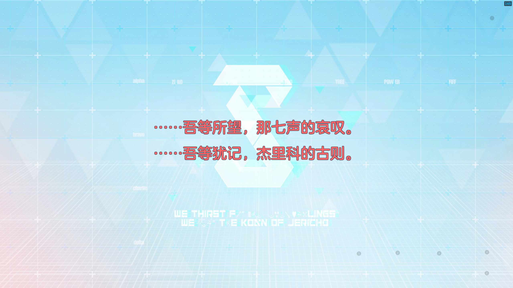

开局和我对话这个“？？？”是谁？（难道是网上传的大阿洛娜？）

？？？：因为就算您什么都不记得了，在相同的情况下，应该还是会做那样的选择吧……

？？？：所以……重要的不是经历，是选择。

？？？：很多很多，只有您才能做出的选择。

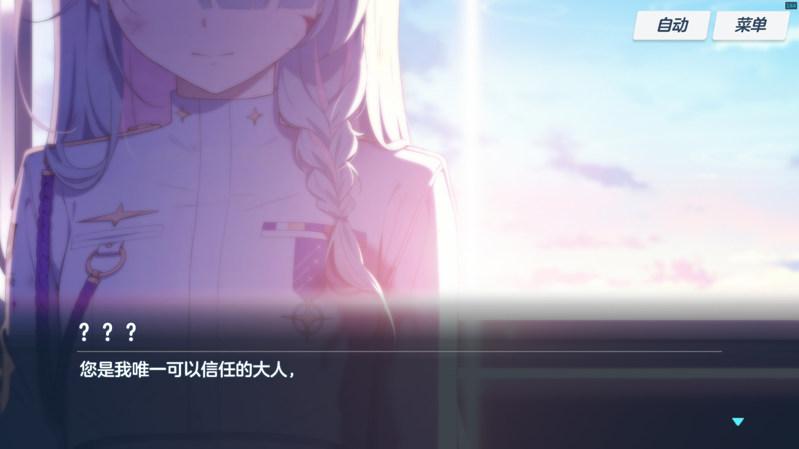

？？？：我相信您一定能找到，通往这扭曲的终点所截然不同的……

？？？：另一种结局的正确选项。

> 通过她给我讲的这些，结合我搜集的资料，有可能这是一周目的结局。即将要启动二周目了。

随后发现自己身处「联邦理事厅」，被「七神凛」叫醒，她自称是联合都市「基沃托斯」联邦理事会的干事。

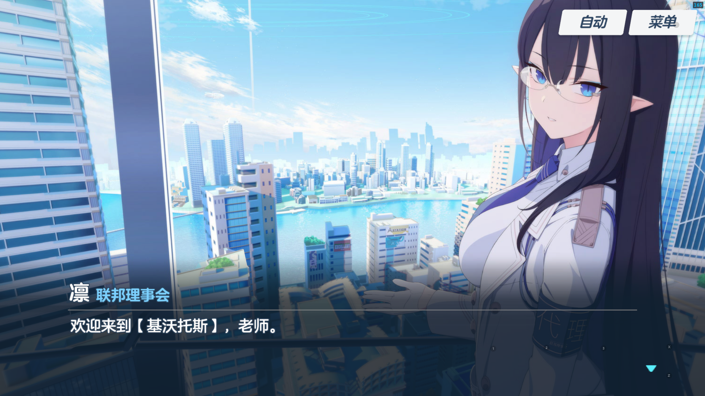

七神凛：基沃托斯是由数千所学院聚合而成的超大型联合都市。也是老师今后工作的地方。

七神凛：您是那位被联邦理事会长选中的人。

随后「早濑优香」突然闯入，提出要见联邦理事会长。紧接着是来自崔尼蒂学院正义实现部的「羽川莲见」、来自歌赫娜学园风纪委员会的「火宫千夏」、以及来自崔尼蒂学院自警团的「守月铃美」也纷纷表达了同样的诉求，说联合都市现在混乱一片，而联邦理事会无作为。令众人惊讶的是联邦理事会并不在席。凛告知诸人「圣所之塔」的最高管理者已不在位，联邦理事会失去了行政控制权。不过好在老师是可以通过认证的（可能就是前面提到的行政控制权？），也就意味着==老师将接替最高管理者的位置==。优香听闻迅速礼貌地向老师介绍了自己。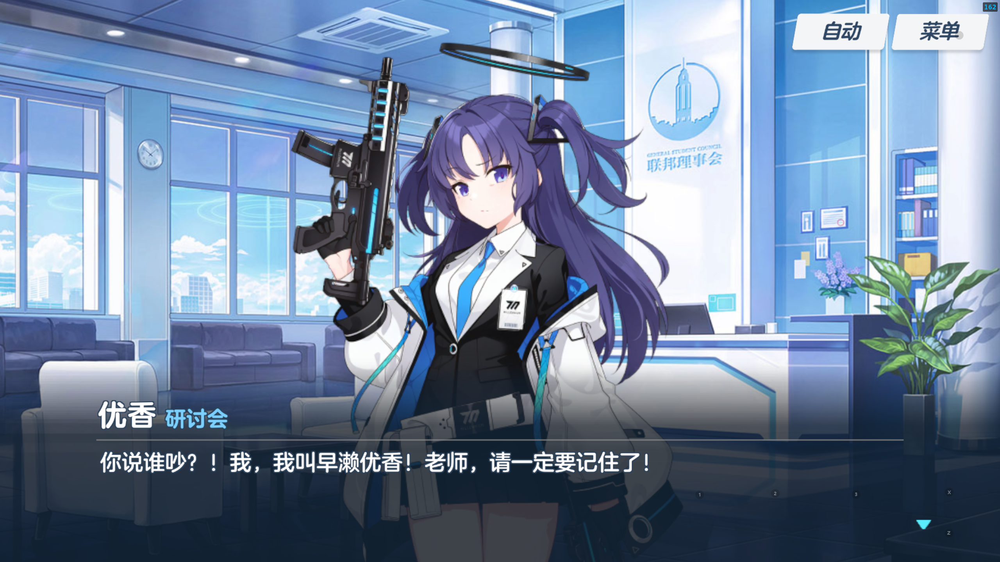

凛讲到，联邦理事会长设立了一个社团，名为「联邦搜查社 沙勒」。沙勒是一个“超常规的机构”。隶属于联邦，所有基沃托斯的学生都可以加入，并且可以在各个自管区内进行战斗活动，不受制约。凛坦言自己也不清楚为何联邦理事会长会设立权力如此庞大的机关。

沙勒活动室地处外围，距离此地（可能是联邦理事会？）有 30 公里远。虽说是栋空楼，但是早先联邦理事会长已命人在那边的地下室里放置了“重要的东西”。

正当凛准备将老师送到沙勒的时候，通过对讲机联系到的「桃可」却说沙勒现在变成了战场。

二话不说，前来联邦理事会“讨要说法”的优香等人（免费劳动力（bushi））也被凛派到沙勒，镇压动乱。

千夏：老师不是本地人……所以和我们不一样，也许只要一颗子弹就会威胁到老师的生命。

## 1-2

战斗结束。学员们感慨有了老师的帮助，这次的战斗格外顺利。优香水到渠成地认可了老师的能力。莲见表示以后的日子就多多拜托老师了（眼神带光，老师真是人见人爱啊）。

## 2-1

查明了这场骚乱的幕后主使——「若藻」，她被百鬼夜行（学院）联合处分后，又从矫正所越狱。若藻也并不清楚“重要的东西”是什么，但是出于对联邦理事会的憎恨，也要毁了那个“重要的东西”。

## 2-2

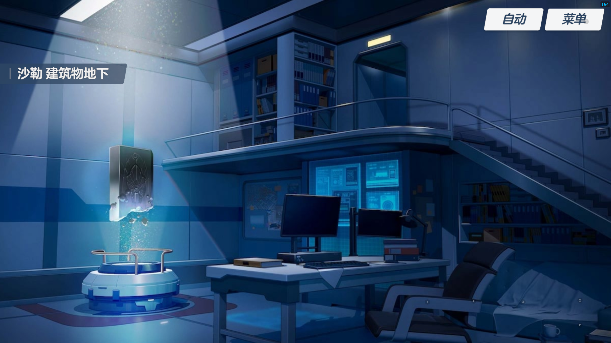

夺回了沙勒活动室。好巧不巧，老师跟若藻在地下室碰了个正着。若藻看到老师后呆住了，大呼一声“失礼了”随后迅速逃离。

凛进入老师办公室，并未察觉若藻进来过，老师也佯装不知（这是怎样的默契？）。然后交给了老师“重要的东西”。

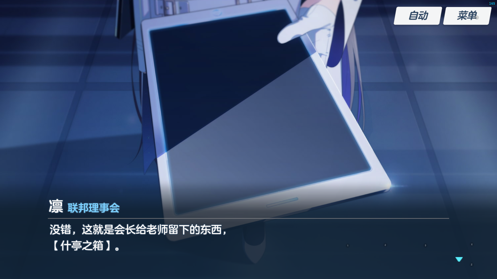

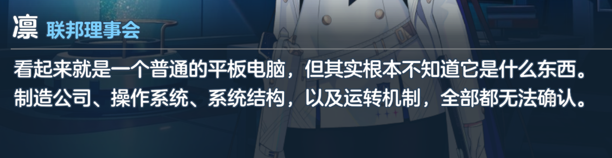

凛说完，便匆匆离开了老师办公室。

## 2-3

老师连接什亭之箱，密码正是序章 1-1 开场那两句话。

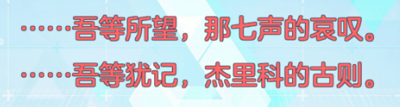

连接成功。

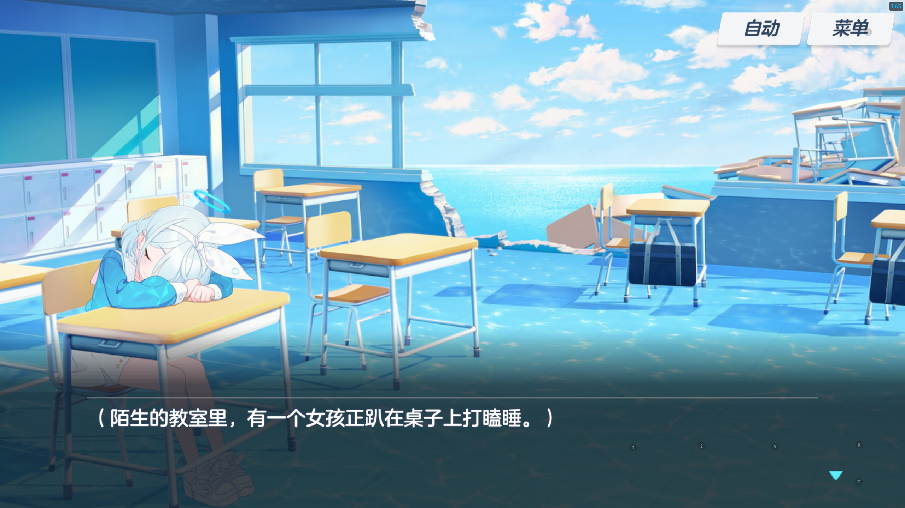

老师把她戳醒以后，她睡眼朦胧了一小会儿，立刻认出了老师。

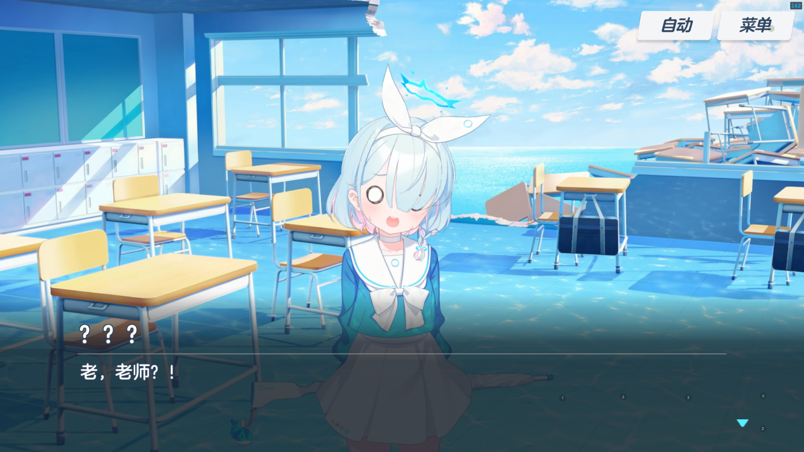

这个“操作系统”还是有亿点可爱的。

阿洛娜问老师是不是有点像拉钩起誓，结果老师竟然说像某外星人电影名场面（可以，明显是致敬 E.T.外星人），并且还质疑了阿洛娜这样的操作系统有些 “低端” 了。

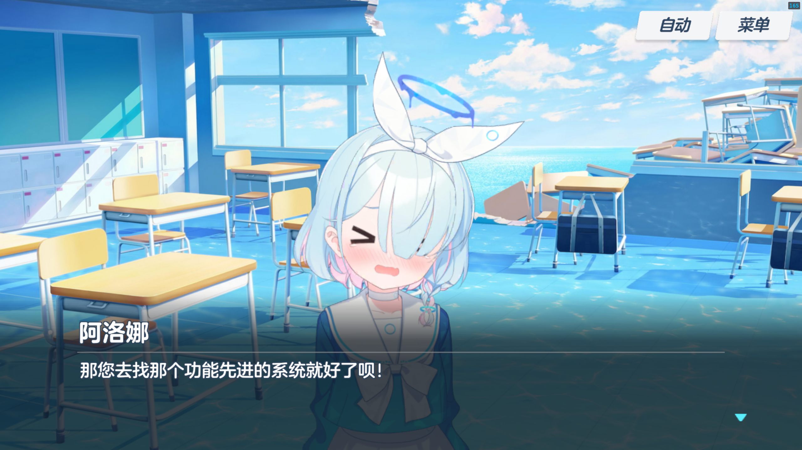

老师还问了她关于联邦理事会长的问题，她却一无所知。然后帮老师修复了圣所之塔的连接权限。

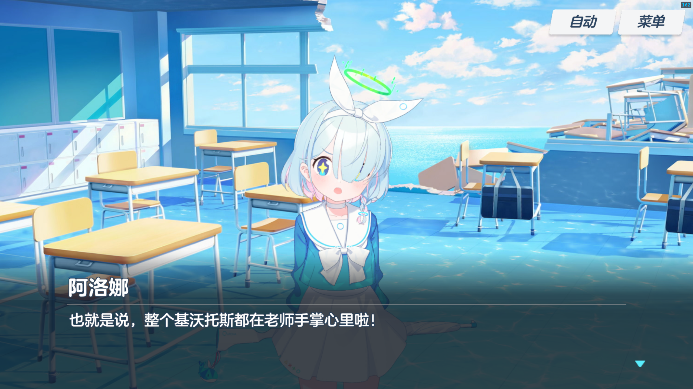

然后老师又批准了圣所之塔的控制权交还给联邦理事会。

凛带着老师参观沙勒。

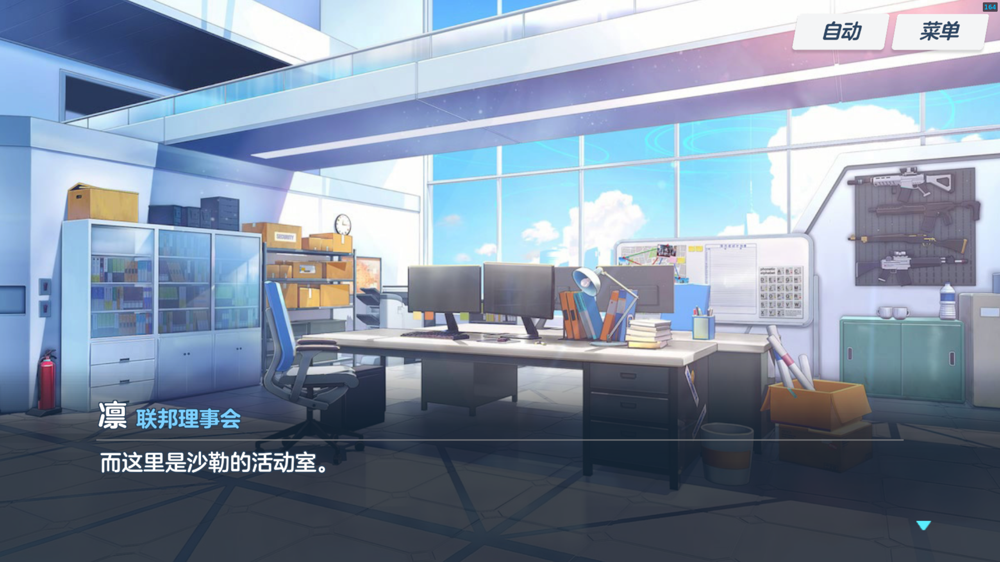

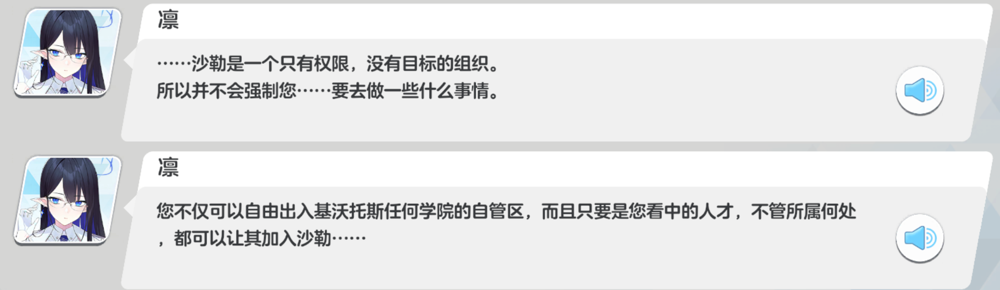

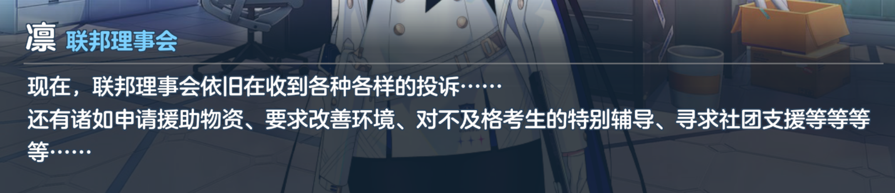

通过凛的讲解，大概是老师要去解决基沃托斯各种各样的问题。

至于老师这边呢，刚刚抵达基沃托斯，就要成大名人了。

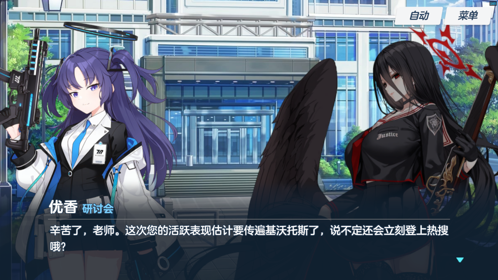

几名学生纷纷表达了对老师的欢迎，期盼老师能光顾她们所在的学院。

送别学生后，回到办公室。

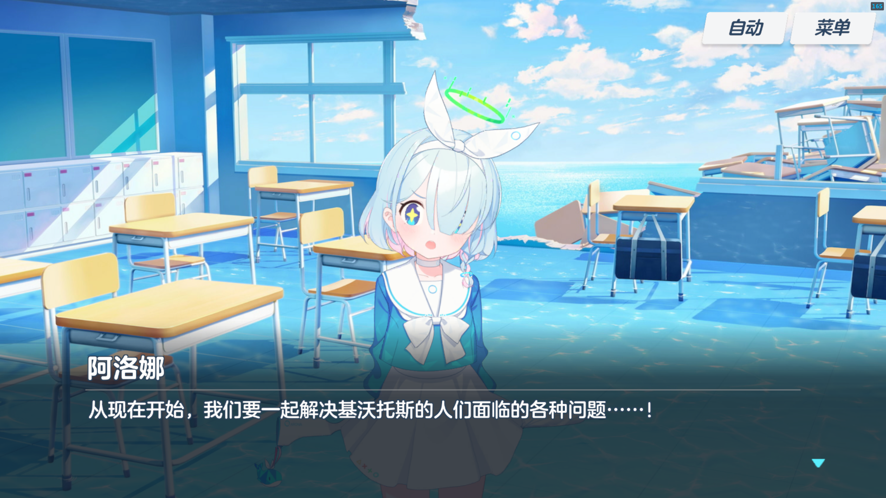

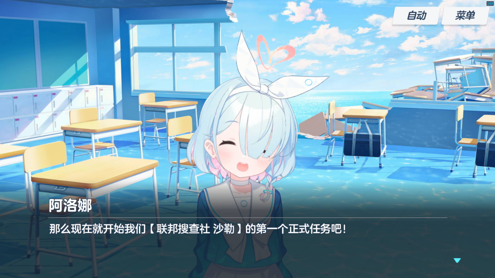

# 第 1 篇   对策委员会

## 第 1 章   对策委员会奇妙的一天

### 01   欢迎来到对策委员会！

### 02   在阿拜多斯的第一天

### 03   大人的力量真了不起！

# 第 2 篇   发条之花的帕凡舞曲篇

# 第 3 篇   伊甸园条约篇

## 第 1 章   补习，正式开始！

### 01 序章